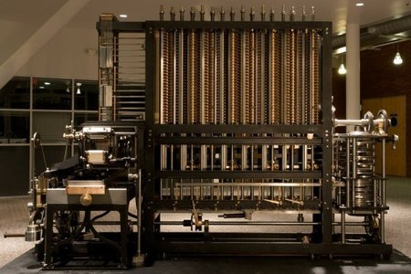
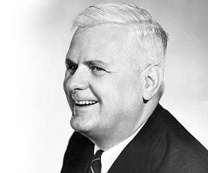
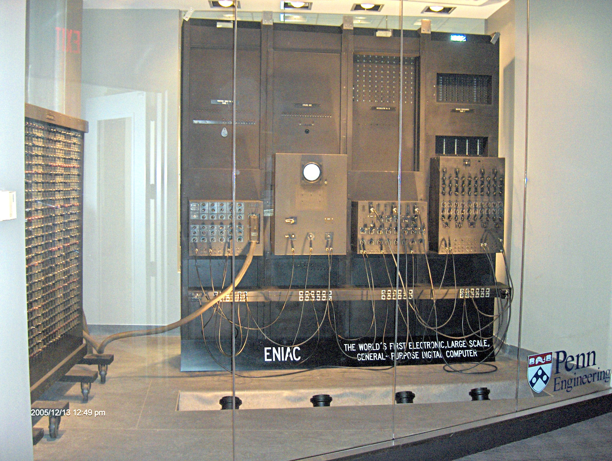
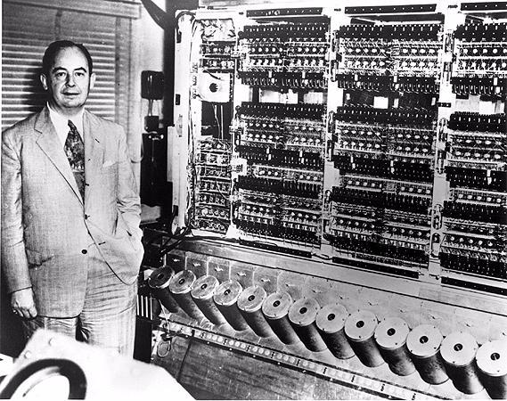
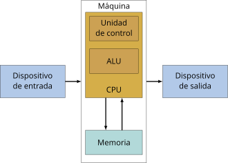
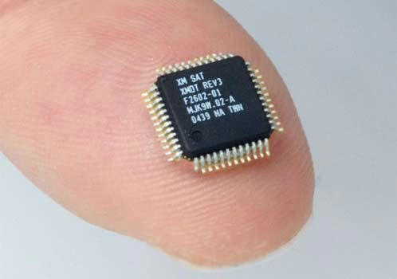
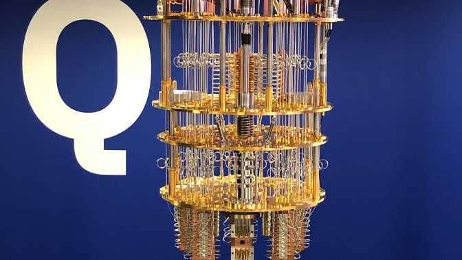
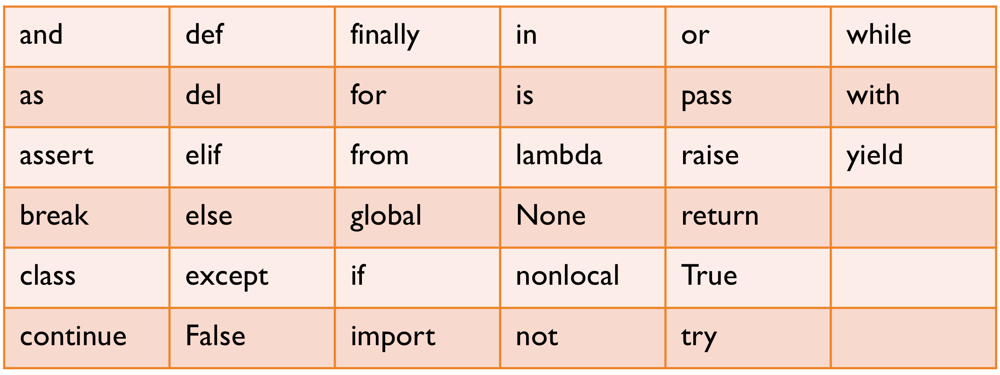
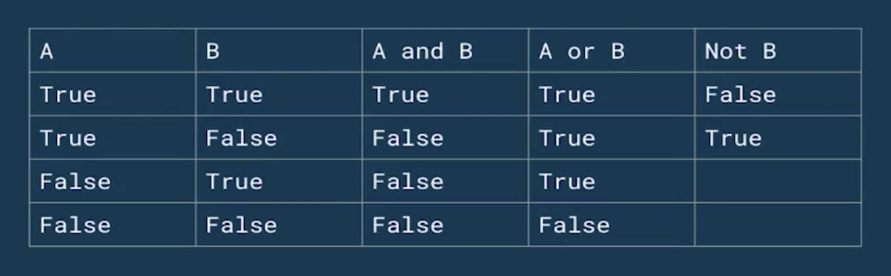

<div align="center">
  <h1>Introducción al Pensamiento Computacional con Python</h1>
</div>

<div align="center"> 
  
</div>

# Introducción al documento

El contenido de este documento esta basado en el curso del mismo nombre dictado por [David Aroesti](https://github.com/jdaroesti) en [Platzi](https://platzi.com/r/karlbehrens/).

# Tabla de contenido
- [Introducción al pensamiento computacional](#Introducción-al-pensamiento-computacional)
  - [Introducción al cómputo](#Introducción-al-cómputo)
  - [Lenguajes de programación](#Lenguajes-de-programación)
- [Introducción a Python](#Introducción-a-Python)
  - [Preparación de tu computadora](#Preparación-de-tu-computadora)
  - [Elementos básicos de Python](#Elementos-básicos-de-Python)
  - [Objetos, expresiones y tipos numéricos](#Objetos,-expresiones-y-tipos-numéricos)
  - [Asignación de variables](#Asignación-de-variables)
  - [Cadenas](#Cadenas)
  - [Entradas](#Entradas)
  - [Programas ramificados](#Programas-ramificados)
  - [Iteraciones](#Iteraciones)
  - [Bucles for](#Bucles-for)
- [Programas numéricos](#Programas-numéricos)
  - [Representación de flotantes](#Representación-de-flotantes)
  - [Enumeración exhaustiva](#Enumeración-exhaustiva)
  - [Aproximación de soluciones](#Aproximación-de-soluciones)
  - [Búsqueda Binaria](#Búsqueda-Binaria)
- [Funciones, alcance y abstracción](#Funciones,-alcance-y-abstracción)
  - [Funciones y abstracción](#Funciones-y-abstracción)
  - [Scope o Alcance](#Scope-o-Alcance)
  - [Especificaciones del código](#Especificaciones-del-código)
  - [Recursividad](#Recursividad)
  - [Funciones como objetos](#Funciones-como-objetos)
- [Tipos estructurados, mutabilidad y funciones de alto nivel](#Tipos-estructurados,-mutabilidad-y-funciones-de-alto-nivel)
  - [Tuplas](#Tuplas)
  - [Rangos](#Rangos)
  - [Listas y mutabilidad](#Listas-y-mutabilidad)
  - [Diccionarios](#Diccionarios)
- [Pruebas y debbugging](#Pruebas-y-debbugging)
  - [Pruebas de caja negra](#Pruebas-de-caja-negra)
  - [Pruebas de caja de cristal](#Pruebas-de-caja-de-cristal)
  - [Debugging](#Debugging)
- [Excepciones y afirmaciones](#Excepciones-y-afirmaciones)
  - [Manejo de excepciones](#Manejo-de-excepciones)
  - [Excepciones como control de flujo](#Excepciones-como-control-de-flujo)
  - [Afirmaciones](#Afirmaciones)

# Introducción al pensamiento computacional
## Introducción al cómputo

Posiblemente la primera computadora fue creada por los **antiguos griegos** el cual tenia el propósito de calcular las posiciones del Sol, Luna y algunos otros cuerpos celestes.

<br>
<div align="center"> 
  
  <h5>Mecanismo Anticitera</h5>
</div>
<br>

Miles de años después se creo el **telar de Jacquard**, en donde las se creaban tarjetas con agujeros que representaban la información que tiene que hacer un pedazo de tela.

<br>
<div align="center"> 
  
  <h5>Telar de Jacquard</h5>
</div>
<br>

Después llego el **motor analítico de Charles Babbage**, el cual ocupo la tecnología de punta en su época para poder realizar cálculos.

<br>
<div align="center"> 
  
  <h5>Motor analítico de Charles Babbage</h5>
</div>
<br>

A finales del siglo XIX el gobierno de EE.UU. tenia serios problemas para realizar los censos como mandaba la constitución. En este momento fue cuando llego la **máquina tabuladora**, la cual se utilizo para realizar los censos con tarjetas, obteniendo resultados mas rápidos y certeros.

<br>
<div align="center"> 
  
  <h5>Máquina Tabuladora</h5>
</div>
<br>

Antiguamente existía la **profesión de computadora**, la cual eran personas que se dedicaban a seguir ciertas instrucciones para obtener los resultados. Sin embargo estos resultados estaban plagados de errores. Al inicio del siglo XX ya existían compañías que tenían la necesidad de realizar cálculos exactos y a gran escala. Es aquí donde llegan **Alan Turing** y **Alonzo Church** con la idea de que todos los algoritmos desarrollados por la humanidad podían ser reducidas a una maquina imaginaria, que tuviera una cinta infinita donde apuntarían símbolos y estos símbolos se pudieran manipular. Es aquí donde se comenzó la carrera para crear la primera computadora electrónica, el cual fue el **ENIAC**.

<br>
<div align="center"> 
  
  
  
  <h5>Alonzo Chruch, Alan Turing y la maquina ENIAC respectivamente.</h5>
</div>
<br>

**John von Neumann** se dio cuenta de que en el hardware no solo se podía almacenar el poder de computo, también los programas para ejecutar. A esta arquitectura se le llama la **arquitectura de von Neumman.** De esta arquitectura nace la máquina **EDVAC** (Electronic Discrete Automatic Computer).

<br>
<div align="center"> 
  
  <h5>John von Neumann junto a la maquina EDVAC.</h5>
</div>
<br>

<br>
<div align="center"> 
  
  <h5>La arquitectura von Neumann.</h5>
</div>
<br>

Con la llegada de los **microchips** llego la pauta para la computación de hoy en día. Estos microchips se hicieron tan pequeños con el tiempo usando la tecnología de la **fotónica.**

<br>
<div align="center"> 
  
  
  <h5>Microchip y Oblea de Silicio respectivamente.</h5>
</div>
<br>

Ya en nuestros tiempos llego la **nube**, el cual son data centers que no son mas que miles o millones de computadoras.

<br>
<div align="center"> 
  
  <h5>Sala de servidores de una nube</h5>
</div>
<br>

**Richar Feyman** nos dio las bases del computo cuántico, el pensaba que no podíamos simular los sistemas cuánticos sino teníamos una computadora cuántica, por lo cual hoy en día estamos en la carrera de la **computación cuántica.**

<br>
<div align="center"> 
  
  
  <h5>Richard Feyman y una computadora cuántica respectivamente.</h5>
</div>
<br>

## Lenguajes de programación

¿Cómo le damos instrucciones a las computadoras? Primero debemos saber que existen **conocimiento declarativo e imperativo.** El conocimiento **declarativo** define las relaciones que existen entre diversas variables, por ejemplo una fórmula matemática. En el caso del **imperativo** nos dice como llegar a un resultado, y dentro de este existen los **algoritmos.**

Un **algoritmo** es una _lista finita de instrucciones_ que describen un cómputo, que cuando se ejecuta con ciertas entradas _(inputs)_ ejecuta pasos intermedios para llegar a un resultado _(output)_. Los algoritmos se conocen desde los antiguos griegos, y fue la evolución de estos que nos dieron los primeros **lenguajes de programación.**

**Ada Lovelace** se dio cuenta de que con las bases teóricas del _motor analítico_ podía calcular una serie de los _números de Bernoulli_, y así creo el primer programa de computación.

<br>
<div align="center"> 
  
  <h5>Ada Lovelace</h5>
</div>
<br>

**Grace Murray Hopper** fue pionera en el mundo de las ciencias de la computación y la primera programadora que utilizó el _Mark I_. Entre las décadas de los 50 y 60 desarrolló el primer compilador para un lenguaje de programación así como también propició métodos de validación. Grace se le ocurrió la idea de tomar unas instrucciones de 1 y 0 para simplificarlos en una instrucción mas entendible para las personas, idea que fue el punta pie inicial para los **lenguajes de programación modernos.**

<br>
<div align="center"> 
  
  <h5>Grace Murray Hopper</h5>
</div>
<br>

En el sentido de la idea de los lenguajes de programación llega **Dennis Ritchie**, el cual fue el inventor del lenguaje _C_, posiblemente uno de los lenguajes mas importantes de la historia.

<br>
<div align="center"> 
  
  <h5>Dennis Ritchie</h5>
</div>
<br>


**Guido van Rossum**, tenia en mente crear un lenguaje de programación que fuera lo mas comprensible posible, eliminando símbolos y sintaxis extrañas, cercano al lenguaje natural. Fue por esta idea en donde nació _Python_.

<br>
<div align="center"> 
  
  <h5>Guido van Rossum</h5>
</div>
<br>

Los **lenguajes de programación** modernos se les conoce como **Turing completeness**, ya que implementan todos los principios para implementar cualquier tipo de _algoritmo._

Todos los **lenguajes** tienen:
- **Sintaxis:** Define la secuencia de símbolos que está bien formada.
- **Semántica estática:** Define que enunciados con sintaxis correcta tienen significado.
- **Semántica:** Define el significado. En los lenguajes de programación solo hay un significado.

# Introducción a Python

## Preparación de tu computadora

Antes de comenzar este curso asegúrate de preparar tu entorno de trabajo para poder hacer todos los ejercicios. A continuación te compartiré los pasos que debes seguir para configurar tu computadora.

Si estás usando Windows asegúrate de instalar lo siguiente en tu computadora:

### Python 3.7 (o superior)
1. Para obtener el instalador dirígete a [https://www.python.org/downloads/](https://www.python.org/downloads/)
2. Descarga el instalador y ejecútalo en tu computadora.
3. Habilita la casilla de verificación en Install launcher for all users y Add Python 3.8 to PATH. A continuación presiona en Install Now. Windows te solicitará permisos para instalar Python en tu computadora.
4. Al finalizar la instalación se abrirá una ventana, en ella deberás presionar en la opción Disable path length limit. Windows te solicitará permisos para realizar este cambio.

### Visual Studio Code

Visual Studio Code es un editor de textos que tiene integradas varias herramientas que te ayudarán a desarrollar tus ejercicios con facilidad. Para obtenerlo en tu computadora, dirígete a: [https://code.visualstudio.com/](https://code.visualstudio.com/)

1. Realiza una instalación normal de Visual Studio code.
2. En Visual Studio Code dirígete al panel de Extensiones, se encuentra en el panel lateral izquierdo. Ahí deberás buscar la extensión llamada Python.
3. Selecciona la extensión creada por Microsoft. Una vez seleccionada, instálala.
4. Una vez instalada, reinicia Visual Studio Code.

Listo con esto podrás correr los programas que escribas en python en la terminal de Visual Studio Code.

## Elementos básicos de Python

En esta sección veremos los elementos básicos de Python, sin embargo estaremos _aprendiendo_ sobre los **elementos básicos** de cualquier lenguaje de programación.

En los lenguajes tenemos definiciones como:

- Bajo nivel vs alto nivel: 
  **Bajo nivel** significa que esta diseñado para las **máquinas**. **Alto nivel** por su parte es orientado a los **humanos.**

- General vs dominio específico: Los lenguajes **generales** tienen todos los primitivos de Turing para poder implementar y computar cualquier tipo de algoritmo. Por otro lado los de **dominio específico** son lenguajes especializados a tareas muy específicas.

- Interpretado vs compilado: En los lenguajes **interpretados** mientras corre el programa se traduce la instrucción a lenguaje máquina que para ejecutar, en cambio para los lenguajes **compilados** estos toman todas las instrucciones y las traduce _antes_ a lenguaje máquina.

Python es un lenguaje de _alto nivel, general e interpretado_.

Los elementos básicos son:

- **Literales:** son formas simples de inicializar objetos directamente en memoria.
  ```
  literales = 1, 'abc', 2.0, True
  ```

- **Operadores:** son los operadores algebraicos.
  ```
  operadores = + / % ** = ==
  ```

Podemos interpolar _literales_ y _operadores_ en nuestros algoritmos. Si el significado dentro de nuestra instrucción no tiene sentido para el lenguaje nos devolverá el tipo de error que tengamos. Para iniciar en consola él interprete lo haremos escribiendo.

```bash
python3
```

Con esto dentro de la consola podremos escribir código de Python.

```py
>>> 1 + 2
3

>>> 1 3.0 # error sintáctico
  File "<stdin>", line 1
    1 3.0
      ^
SyntaxError: invalid syntax

>>> 5 / 'Texto' # error semántico estático
Traceback (most recent call last):
  File "<stdin>", line 1, in <module>
TypeError: unsupported operand type(s) for /: 'int' and 'str'

>>> 5 * 'Texto'
'TextoTextoTextoTextoTexto'

>>> print('Hello, world!') # statement o enunciado
Hello, world!
```

## Objetos, expresiones y tipos numéricos

Vamos hablar de **objetos, expresiones y tipos numéricos.**

- **Objetos**: son la abstracción más alta de cualquier lenguaje de programación, son la forma en que modelamos el mundo dentro de nuestros programas. Los objetos se encuentran en memoria y podemos referenciarlas con algún tipo de variable.

- **Tipos**: los _objetos_ pueden ser enteros, flotantes, booleanos e incluso pueden ser objetos más complejos como el modelo de un humano con todos sus características y atributos. 

- **Escalares vs no escalares**: los **escalares** son datos que podemos subdividir en piezas fundamentales, estos pueden ser enteros, flotantes, etc. Los **no escalares** son los datos que no podemos _subdividir_.

```py
>>> <objeto> <operador> <objeto>  # Esta es una expresión
<valor>

>>> 'Estoy' + 'Programando!'      # Con esta expresión
'EstoyProgramando!'               # Obtenemos este valor

>>> 2 + 2                         # Con esta expresión
4                                 # Obtenemos este valor
```

En Python podemos ver los tipos de datos que contienen nuestros objetos _(variables)_, para esto usamos la función **Type.**

```bash
>>> my_int = 1
>>> my_float = 1.0
>>> my_bool = False
>>> my_none = None

# Imprimiremos los tipos de nuestras variables.

>>> type(my_int)
<class 'int'> 

>>> type(my_float)
<class 'float'>

>>> type(my_bool)
<class 'bool'>

>>> type(my_none)
<class 'NoneType'>
```

## Asignación de variables

Las **variables** son simplemente _nombres_ que se vinculan con un _valor en memoria_, y la forma en la que los _vinculamos_ es a través del **operador de asignación (=)**, y para _comparar_ su valor utilizamos **2 veces el operador de asignación (==).** La forma correcta de nombrar nuestras variables es darles un nombre _descriptivo_.

```py
# Tenemos unas variables que no entendemos que representan
a = 2
x = 4
z = (a * x) / 2

# Y las cambiamos por unas mas descriptivas
base = 2
altura = 4
area = (base * altura) / 2
```

También podemos **reasignar** valores a nuestras _variables_.

```bash
# A my_var le asignamos un valor
>>> my_var = 'Hello, world'
>>> print(my_var)
Hello, world

# Luego reasignamos otro valor
>>> my_var = 3
>>> print(my_var)
3
```

Cuando el espacio en memoria ya no tiene ninguna variable que la referencie, el **garabage collector** libera este espacio.

Cada uno de los lenguajes de programación tiene sus reglas. Algunas reglas para las variables en Python son:

- Pueden contener mayúsculas, minúsculas, números(sin comenzar con uno) y el símbolo _
- No pueden llamarse como las **palabras reservadas**.

Los lenguajes tienen algo llamado **palabras reservadas**, estas son objetos dentro del lenguaje que ya tienen alguna función o valor asignado.

<br>
<div align="center"> 
  
</div>
<br>

## Cadenas

Las **cadenas** son secuencias de caracteres.

```py
'123'         #Esta es una cadena
```

Los _operadores_ que utilizamos tienen otros significados. Cuando utilizamos el operador **multiplicar (*)** lo que haremos es multiplicar la cadena por el numero de veces que deseamos, y con el operador **suma (+)** concatenaremos varias cadenas, sin embargo _Python_ nos permite concatenar de una forma mas legible.

```py
'123' * 3               # Con el operador *
'123123123'             # Obtenemos este resultado.

'123' + '456'           # Y el operador +
'123456'                # Concatenara las cadenas.

('Hip ' * 3) + 'hurra'  # También podemos combinar operadores
'Hip Hip Hip hurra'

f'{"Hip " * 3}hurra'    # En Python podemos usar la expresión f para concatenar
'Hip Hip Hip hurra'
```

A las cadenas les podemos asignar diversas funciones:

- len: nos indica la longitud de la cadena.
- indexing: con esto podemos acceder a cada uno de los elementos de esta cadena a través de indices.
- slicing: podemos dividir las cadenas subcadenas.

```py
my_str = 'Hello, world!'    # Creamos una cadena

len(my_str)                 # Consultamos por su longitud
13

my_str[0]                   # Con slicing consultamos por el 1er caracter.
'H'

my_str[1]                   # Consultamos por el 2do caracter.
'e'

my_str[2]                   # Consultamos por el 3er caracter.
'l'

my_str[2:]                  # Traemos desde el 3er caracter hasta el final.
'llo, world!'

# Es importante indicar que los finales no son inclusivos.

my_str[:3]                  # Tremos desde el principio hasta el 3ro.
'Hel'

my_str[2:5]                 # Traemos desde el 3er caracter hasta el 5to.
'llo'

my_str[::2]                 # Traemos desde el principio hasta el final saltando de 2 en 2.
'Hlo ol!'
```

- Los objetos de tipo str pueden representarse con _comillas dobles (")_ o _comillas simples (')_
- El operador _suma (+)_ tiene diferente significado según el tipo de dato. Con **cadenas** significa _concatenación_.
- El operador _multiplicación (*)_ es el operador de _repetición_ con **cadenas**.
- Las cadenas son **inmutables**. Esto significa que una vez que creamos una cadena en memoria esta ya no puede cambiar, podemos reasignar la variable que la referencia a otro valor, pero la cadena en memoria no cambiara.

## Entradas

Las **entradas** son una forma recibir información para que las computadoras logren realizas cómputos.

- Python tiene la función input para recibir datos del usuario del programa
- Input siempre regresa cadenas, por lo que si queremos utilizar otro tipo, tenemos que hacer _type casting_. El _type casting_ es **transformar** el tipo de dato en otro, con esto podemos transformar el tipo y guardarlo en memoria asignándolo a una variable.

```bash
nombre = input('Cual es tu nombre: ')   # Utilizamos input para ingresar un nombre
Cual es tu nombre: Karl

print(nombre) # Vemos que contiene nuestra variable nombre
Karl

print(f'Tu nombre es {nombre}')   # Imprimimos una cadena concatenando una oración con nuestra variable.
Tu nombre es Karl

numero = input('Escribe un numero: ')   # Utilizamos input para ingresar un numero
Escribe un numero: 45

numero    # Vemos que contiene nuestra variable numero
'45'

type(numero)    # Vemos el tipo de dato que es numero
<class 'str'>   # Y vemos que es un str

numero = int(input('Escribe un numero: '))  # Pero si definimos previamente el input como int
Escribe un numero: 45

type(numero)    # Nuestra variable numero sera de tipo int
<class 'int'>
```

## Programas ramificados

Para que nuestros programas realicen trabajos interesantes estos deben ser capaces de tomar decisiones, test o pruebas, es desde este concepto donde salen las **ramificaciones.** Dentro de los test que podemos realizar son los operadores de **comparación** y estos nos devolverás si la comparación es **verdadera (True)** o **falsa (False).**

- **Igual (==)**: Lo utilizaremos para comparar 2 objetos.
- **Distinto (!=)**: Verificamos que los objetos sean distintos.
- **Mayor que (>)**: Igual que en álgebra, comparamos si el primer termino es mayor que el segundo.
- **Menor que (<)**: Verificamos que el primer termino sea menor que el segundo.
- **Mayor igual que (>=)**: Verificamos que el primer termino sea mayor igual al segundo.
- **Menor igual que (<=)**: Verificamos que el primer termino sea menor igual al segundo.

Además de los operadores de comparación también tenemos los operadores lógicos, estos son 3 **(and, or, not).**

<br>
<div align="center"> 
  
</div>
<br>

Una vez que podemos entender bien los operadores de comparación y lógicos podemos generar nuestros **programas ramificados.** Una forma típica de ocupar los operadores es con el método **if.**

```py
if condition:   # Evaluamos en primera instancia una condición.
    expresion
elif:           # En caso de que no se cumpla la condición anterior evaluamos nuevamente con otra.
    expresion
else:           # En caso de que no se cumpla ninguna condición.
    expresion

# En el ejemplo anterior pueden es obligatorio el 'if', sin embargo 'elif'
# y 'else' son opcionales. Pueden existir cuantos 'elif' queramos, pero solo
# puede haber 1 'if' y 1 'else'.

if 4 > 5:
    ...
elif 4 < 5:
    print('4 es menor que 5')
else:
    ...
```

Para poner en práctica esto crearemos un archivo _programas_ramificados.py_ y dentro de el escribiremos:

```py
num_1 = int(input('Escoge un entero: '))    # Preguntamos por un primer número.
num_2 = int(input('Escoge otro entero: '))  # Luego preguntamos por un segundo número.

if num_1 > num_2:       # Si el primer número es mayor que el segundo.
    print('El primer número es mayor que el segundo.')  # Imprimimos esta expresión.
elif num_1 < num_2:     # En caso de que el segundo sea mayor.
    print('El segundo número es mayor que el primero.') # Imprimiremos esta expresión.
else:   # En caso de que no cumpla ninguna condición.
    print('Los 2 números son iguales.')
```

Para ejecutar nuestro programa iremos a la terminal y escribiremos

```
python3 la/dirección/relativa/de/tu/archivo/programas_ramificados.py
```

y en consola nos preguntara nuestros números y nos dará un resultado

```
Escoge un entero: 8
Escoge otro entero: 4
El primer número es mayor que el segundo.
```
```
Escoge un entero: 7
Escoge otro entero: 10
El segundo número es mayor que el primero.
```
```
Escoge un entero: 4
Escoge otro entero: 4
Los 2 números son iguales.
```

## Iteraciones

Las **iteraciones** nos permiten repetir las operaciones de una manera simple.

- La mayoría de las tareas computacionales no se pueden lograr con ramificaciones.
- Cuando queremos que un programa haga lo mismo varias veces, utilizaremos iteraciones.
- Se pueden escribir iteraciones dentro de iteraciones.
- Podemos utilizar _break_ para salir de una iteración.
- Tener cuidado de iteraciones infinitas.

Para poner en práctica las iteración crearemos el archivo _iteraciones.py_

```py
contador = 0

while contador < 10:
    print(contador)
    contador += 1   # contador = contador + 1
```

Luego iremos a la consola para ejecutar nuestro archivo.

```
python3 la/dirección/relativa/de/tu/archivo/iteraciones.py
```

Y veremos que en nuestra consola se imprimirán los números del 0 al 9.

Si queremos que nuestro programa salga de la iteración cuando se cumpla cierta condición usaremos **break.**

```py
contador = 0

while contador < 10:
    print(contador)
    contador += 1       # contador = contador + 1

    if contador > 6:    # Cuando contador sea mayor que 6 terminara la iteración.
        break
```

## Bucles for

Los bucles, en diversos lenguajes de programación pueden ser definidos o indefinidos. Los bucles definidos preestablecen las condiciones de la iteración por adelantado. Por su parte, los bucles indefinidos establecen la condición en la que una iteración terminará. En este último tipo de bucles existe el riesgo de que el bucle se vuelva infinito (cuando la condición de suspensión nunca se cumple).

Los bucles definidos se implementan en Python a través del keyword **for**. Por su parte, los bucles indefinidos se implementan con el keyword **while**.

Sin embargo, esta no es la única forma de implementar bucles definidos. Por ejemplo, Javascript puede implementar un bucle definido mediante el siguiente constructo:

```py
for (i = 0; i <= 10; i++) {
  <expresión>
}
```

El bucle se puede leer de la siguiente manera:

- Inicializa el bucle en 0
- Continua el bucle mientras **i** sea menor o igual que 10
- Incrementa i en uno al final de cada iteración

Es importante señalar que la expresión **i++** es equivalente a lo que en Python escribiríamos como **i += 1.**

Una segunda forma de crear un bucle definido es iterando en una colección de objetos. Esta es la forma que Python utiliza:

```py
for <variable> in <iterable>:
    <expresión>
```

### El bucle for en Python

En la definición anterior debemos entender <_iterable_> como una colección de objetos; y la <_variable_> como el elemento específico que se está exponiendo mediante el bucle en cada iteración.

```py
>>> frutas = ['manzana', 'pera', 'mango']
>>> for fruta in frutas:
        print(fruta)


manzana
pera
mango
```

### Iterables

En Python, un iterable es un objeto que se puede utilizar en un bucle definido. Si un objeto es iterable significa que se puede pasar como argumento a la función **iter**. El **iterable** que se pasa como parámetro a la función **iter** regresa un **iterator**.

```py
>>> iter('cadena')                  # cadena
>>> iter(['a', 'b', 'c'])           # lista
>>> iter(('a', 'b', 'c'))           # tupla
>>> iter({'a', 'b', 'c'})           # conjunto
>>> iter({'a': 1, 'b': 2, 'c': 3})  # diccionario
```

Todas las llamadas anteriores regresan un objeto de tipo **iterator**.

¿Qué pasa si le pasamos a la función **iter** un objeto que no en **iterable**? Obtendremos un **TypeError** que señala que el objeto no es un **iterable**. Esto es un ejemplo de programación defensiva en el que Python verifica el tipo del objeto antes de proceder al cómputo. ¡Intentalo en tu consola!

Es importante señalar que estos no son los únicos tipos de objetos que pueden ser **iterable**. Existen gran cantidad de ejemplos en la librería estándar y, de hecho, casi cualquier objeto se puede convertir en un **iterable** (pero eso ya lo veremos cuando hablemos de Python avanzado).

### Iterators

Ahora que ya sabemos cómo obtener un **iterator**, ¿Qué podemos hacer con él? Un **iterator** es un objeto que regresa sucesivamente los valores asociados con el iterable.

```py
>>> frutas = ['manzana', 'pera', 'mango']
>>> iterador = iter(frutas)
>>> next(iterador)
manzana
>>> next(iterador)
pera
>>> next(iterador)
mango
```

Como puedes ver, el **iterator** guarda el estado interno de la iteración, de tal manera que cada llamada sucesiva a **next** regresa el siguiente elemento. ¿Qué pasa una vez que ya no existan más elementos en el **iterable**? La llamada a **next** arrojará un error de tipo **StopIteration**.

### ¿Cómo implementa Python los bucles definidos?

Ahora ya conocemos todos los elementos necesarios para entender que es lo que sucede en Python cuando ejecutamos un bucle **for**. Considera nuevamente el siguiente código:

```py
>>> frutas = ['manzana', 'pera', 'mango']
>>> for fruta in frutas:
        print(fruta)
```

Este bucle se puede describir con los conceptos que explicamos previamente:

1. Python llama internamente la función **iter** para obtener un **iterator**
2. Una vez que tiene un **iterator** llama repetidamente la función next para tener acceso al siguiente elemento en el bucle.
3. Detiene el bucle una vez que se arroja el error **StopIteration**.

### Bucles for con diccionarios

Para iterar a lo largo de un diccionario tenemos varias opciones:

- Ejecutar el bucle **for** directamente en el diccionario, lo cual nos permite iterar a lo largo de las llaves del diccionario.
- Ejecutar el bucle **for** en la llamada **keys** del diccionario, lo cual nos permite iterar a lo largo de las llaves del diccionario.
- Ejecutar el bucle **for** en la llamada **values** del diccionario, lo cual nos permite iterar a lo largo de los valores del diccionario.
- Ejecutar el bucle **for** en la llamada **items** del diccionario, lo cual nos permite iterar en una tupla de las llaves y los valores del diccionario.

```py
estudiantes = {
    'mexico': 10,
    'colombia': 15,
    'puerto_rico': 4,
}

for pais in estudiantes:
    ...

for pais in estudiantes.keys():
    ...

for numero_de_estudiantes in estudiantes.values():
    ...

for pais, numero_de_estudiantes in estudiantes.items():
    ...
```

### Modificación del comportamiento de un bucle for

Podemos modificar el comportamiento de un bucle **for** mediante los _keywords_ **break** y **continue**.

**break** termina el bucle y permite continuar con el resto del flujo de nuestro programa.

**continue** termina la iteración en curso y continua con el siguiente ciclo de iteración.

### Conclusiones

Como pudimos observar, Python implementa los bucles definidos mediante los bucles **for**. Esta implementación nos permite iterar a lo largo de cualquier objeto que sea iterable. Para iterar necesitamos un iterador que nos regresará el siguiente valor en cada iteración. Todo esto, Python lo puede hacer por nosotros con el constructo **for ... in ...**.

# Programas numéricos

## Representación de flotantes

La mayoría del tiempo los números flotantes (tipo **float**) son una muy buena aproximación de los números que queremos calcular con nuestras computadoras. Sin embargo, “la mayoría del tiempo” no significa todo el tiempo, y cuando no se comportan de esta manera puede tener consecuencias inesperadas.

Por ejemplo, trata de correr el siguiente código:

```py
x = 0.0
for i in range(10):
    x += 0.1

if x == 1.0:
    print(f'x = {x}')
else:
    print(f'x != {x}')
```

Es probable que te hayas sorprendido con el resultado. La mayoría de nosotros esperaríamos que imprimiera **1.0** en vez de **0.999999999999**. ¿Qué es lo que pasó?.

Para entender qué es lo que pasó tenemos que entender que es lo que pasa en la computadora cuando realizamos cómputos con números flotantes. Y para eso necesitamos entender números binarios.

Cuando aprendiste a contar, lo que en realidad aprendiste es una técnica combinatoria para manipular los siguientes símbolos que le llamamos números: 0, 1, 2, 3, 4, 5, 6, 7, 8, 9.

La forma en la que funciona esta técnica es asignando el número 10 a la 0 al número de la extrema derecha, 10 a la 1 al siguiente, 10 a la 2 al siguiente y así sucesivamente. De tal manera que el número 525 es simplemente la representación de **(5 * 100) + (2 * 10) + (5 * 1)**.

Esto nos dice que el número de números que podemos representar depende de cuanto espacio tengamos. Si tenemos un espacio de 3, podemos representar 1,000 números (10 elevado a la 3) o la secuencia del 0 al 999. Si tenemos 4, podemos representar 10,000 (10 elevado a la 4) o la secuencia del 0 al 9,999. De manera general podemos decir que con una secuencia de tamaño n, podemos representar 10 elevado a la n números.

Los números binarios funcionan de la misma manera (de hecho cualquier número en cualquier base, por ejemplo, octales o hexadecimales). La única diferencia es cuántos símbolos tenemos para representar. En binario nada más tenemos 0, 1;
en hexadecimal tenemos 0, 1, 2, 3, 4, 5, 6, 7, 8, 9, a, b, c, d, e, f.

De esta manera podemos decir que el número de la extrema derecha es **cantidad_de_simbolos^0**, **cantidad_de_simbolos^1**, **cantidad_de_simbolos^2**, etc. Por lo que en binario, que nada más tenemos 2 símbolos, decimos **2^0**, **2^1**, **2^2**, etc. Por ejemplo el número binario 101 es la representación de **(1 * 4) + (0 * 2) + (1 * 1)**, es decir 5.

Esta representación nos permite trabajar con todos los números positivos enteros dentro del computador, pero ¿Qué hacemos con los negativos y los racionales?.

El caso de los números negativos es sencillo: simplemente agregamos un bit adicional que representa el signo y la añadimos en la extrema izquierda. Por lo que el número **0**101 sería +5 y el número **1**101 sería -5.

El caso de los racionales es más complejo. En la mayoría de los lenguajes de programación modernos los racionales utilizan una implementación llamada punto flotante. ¿Cómo funciona esta representación?.

Antes de pasar a binario, vamos a pretender que estamos trabajando con una computadora basada en decimales. Un número flotante lo representaríamos con un par de enteros: los dígitos significativos y el exponente. Por ejemplo, el número 2.345 se representaría como **(2345 * 10^-3)** o **(2345, -3)**.

El número de dígitos significativos determinan la precisión con la que podemos representar número. Por ejemplo si nada más tuviéramos dos dígitos significativos el número 2.345 no se podría representar de manera exacta y tendríamos que convertirlo a una aproximación, en este caso 2.3.

Ahora pasemos a la verdadera representación interna de la computadora, que es en binario. ¿Cómo representarías el número 5/8 o 0.625? Lo primero que tenemos que saber es que 5/8 es en realidad el número **5 * 2^-3.** Por lo que podríamos decir (101, -11) (recuerda que el número 5 es 101 en binario y el 3 es 11).

Regresemos a nuestro problema inicial: ¿Cómo representaremos 1/10 (que escribimos en Python cómo 0.1)? Lo mejor que podemos hacer con cuatro dígitos significativos es (0011, -101) que es equivalente a 3/32 (0.09375). ¿Qué tal si tuviéramos cinco dígitos significativos? La mejor representación sería (11001, -1000) que es equivalente a 25/256 (0.09765625). ¿Cuántos dígitos significativos necesitamos entonces? Un número infinito. No existe ningún número que cumpla con la siguiente ecuación: **sim * 2^-exp**.

En la mayoría de las implementaciones de Python tenemos 53 bits de precisión para números flotantes. Así que los dígitos significativos para representar el número 0.1 es igual a:

11001100110011001100110011001100110011001100110011001 que es equivalente al número decimal: 0.1000000000000000055511151231257827021181583404541015625

Muy cercano a 1/10 pero no exactamente 1/10. Ahora ya sabemos la razón de esa respuesta tan extraña. Hay muy pocas situaciones en la que 1.0 es aceptable, pero 0.9999999999999999 no. Pero ¿Cuál es la moraleja de esta historia?

Hasta ahora hemos verificado igualdad con el operador **==**. Sin embargo, cuando estamos trabajando con flotantes es mejor asegurarnos que los números sean aproximados en vez de idénticos. Por ejemplo **x < 1.0 and x > 0.99999**.

## Enumeración exhaustiva

También llamado "adivina y verifica" donde simplemente generamos todas las posibilidades. Técnicamente este no es un algoritmo eficiente, sin embargo, dependiendo del universo de posibilidades puede ser que sea el mas adecuado, ya que _las computadoras actuales son muy rápidas_ y por lo tanto la eficiencia de nuestro programa no es relevante, por lo tanto siempre ten en mente este tipo de **algoritmo** como uno de los **primeros en implementar**.

Vamos a crear un ejemplo de enumeración exhaustiva buscando la raíz cuadrada exacta de un numero.

```py
objetivo = int(input('Escoge un entero: '))

"""Inicializamos respuesta como 0"""
respuesta = 0

"""Mientras respuesta^2 sea menor que nuestro numero objetivo."""
while respuesta**2 < objetivo:
    respuesta += 1  # Respuesta aumentara en 1.

if respuesta**2 == objetivo:
    print(f'La raíz cuadrada de {objetivo} es {respuesta}')

else:
    print(f'{objetivo} no tiene una raíz cuadrada exacta')
```

## Aproximación de soluciones

Es similar a la enumeración exhaustiva, pero no necesita una respuesta exacta, por lo tanto podemos aproximar soluciones con un margen de error que llamaremos **epsilon**.

Como siempre en programación debemos hacer un _trade-off_, no podemos ser precisos y rápidos a la vez, por lo tanto cuando nuestro **epsilon** es muy pequeño esto significa que debemos realizar **mas iteraciones** para llegar a la aproximación, lo cual significa sacrificar tiempo. Y por otro lado si queremos que nuestro **tiempo de ejecución** sea lo **mas corto posible** debemos sacrificar la **precisión** aumentando el valor de **epsilon**.

```py
objetivo = int(input('Escoge un numero: '))

epsilon = 0.01      # Definimos un margen de error.
paso = epsilon**2   # Los pasos para buscar la raíz sera igual a epsilon^2
respuesta = 0       # Inicializamos una respuesta 0


while abs(respuesta**2 - objetivo) >= epsilon and respuesta <= objetivo:
    respuesta += paso

if abs(respuesta**2 - objetivo) >= epsilon:
    print(f'No se encontró la raiz cuadrada de {objetivo}')
else:
    print(f'La raiz cuadrada de {objetivo} es {respuesta}')
```

Puedes intentar ir moviendo la magnitud de epsilon para obtener una mejor precisión o mejorar el tiempo de ejecución.

## Búsqueda Binaria

Cuando la respuesta se encuentra en un conjunto ordenado, podemos utilizar **búsqueda binaria**. Es altamente eficiente, pues corta el espacio de búsqueda en dos por cada iteración. Los pasos que sigue son:

1. Consideramos como segmento inicial de búsqueda a la lista completa.
2. Analizamos el punto medio del segmento (el valor central), si es el valor buscado, devolvemos el índice del punto medio.
3. Si el valor central es mayor al buscado, podemos descartar el segmento que está desde el punto medio hacia la a derecha.
4. Si el valor central es menor al buscado, podemos descartar el segmento que está desde el punto medio hacia la izquierda.
5. Una vez descartado el segmento que no nos interesa, volvemos a analizar el segmento restante, de la misma forma.
6. Si en algún momento el segmento a analizar tiene longitud 0 o negativa significa que el valor buscado no se encuentra en la lista.

Para verlo de forma gráfica buscaremos el valor 18 en la lista [1, 3, 5, 7, 9, 11, 13, 15, 17, 19, 21, 23].

<br>
<div align="center"> 
  
</div>
<br>

Para realizar un ejemplo práctico crearemos un programa para buscar raíces cuadradas.

```py
objetivo = int(input('Escoge un numero: '))

epsilon = 0.01  # Definimos nuestro margen de error.

bajo = 0.0      # Inicializamos la parte baja de nuestra búsqueda como 0
alto = max(1.0, objetivo)   # Entre el numero que ingresamos y 1 vamos a tomar el mayor valor.
respuesta = (alto + bajo) / 2   # Definimos la mitad entre bajo y alto.

# Mientras el margen de error sea mayor a epsilon.
while abs(respuesta**2 - objetivo) >= epsilon:

    # Si ((alto+bajo)/2)^2 es menor a nuestro numero objetivo
    if respuesta**2 < objetivo:
        
        # Definimos la parte baja de nuestra búsqueda como (alto + bajo)/2
        bajo = respuesta

    # En caso que (alto+bajo)/2 es mayor a nuestro numero objetivo
    else: 
        # Definimos la parte baja de nuestra búsqueda como (alto + bajo)/2
        alto = respuesta

    # Luego definimos nuevamente la mitad entre alto y bajo.
    respuesta = (alto + bajo) / 2

# Cuando el ciclo ya alcance un error menor a epsilon imprimiremos el resultado.
print(f'La raíz cuadrada de {objetivo} es {respuesta}')
```

Este algoritmo es extremadamente rápido en comparación a los anteriores y esto es justamente lo que lo hace uno de los mas potentes.

# Funciones, alcance y abstracción

## Funciones y abstracción

La **abstracción** significa que no necesitas entender como funciona algo para utilizarlo. Un ejemplo de esto es una _calculadora_, en este caso no muchos saben como funciona el circuito interno de una calculadora, sin embargo esto no nos limita a utilizarlo, ya que solo necesitamos saber como operarlo.

Una de las habilidades mas importantes en la programación es la **abstracción**, ya que utilizaremos la mayoría del tiempo códigos y librerías de otras personas, por lo que solamente debemos saber operarlos.

La **decomposición** nos permite dividir el código en **componentes (funciones)** que colaboran con un fin en común. Esto se puede pensar como mini programas dentro de un programa mayor.

Para poder escribir una **función** en _Python_ lo hacemos con **def**

```py
"""Las funciones se definen con 'def' luego del nombre y los parámetros que necesitara."""
def nombre(parámetros):

    """Ejecutamos las expresiones que necesitemos"""
    cuerpo

    """Y retornaremos el valor que queramos. El return no es obligatorio."""
    return expresion

"""Aquí definimos una función suma"""
def suma(a, b):
    total = a + b
    return total

"""Y para ejecutarlo simplemente llamamos a la
función por su nombre e ingresamos los parámetros que necesita"""
suma(2, 3)
```
En las funciones existen los **valores por defecto**, esto significa que en caso de que no se ingrese el argumento este ya tendrá un **valor por defecto.** También existen los keywords que significa que al llamar la función podemos llamar al nombre del argumento para asignarles un valor.

```py
"""Definimos una función con valor por defecto de "inverso = False"""
def nombre_completo(nombre, apellido, inverso=False)
    if inverso:
        return f'{apellido} {nombre}'
    else:
        return f'{nombre} {apellido}'

"""De forma ordena ingreso los valores a los parámetros de la función.
Sin embargo no es necesario ingresar un valor para "inverso", ya que
tiene un valor por defecto ya asignado"""
nombre_completo('Karl', 'Behrens')

"""En este caso ingresaremos el valor 'True' para 'inverso' """
nombre_completo('Karl', 'Behrens', inverso=True)

"""Con Keywords podemos ingresar las variables en el orden que
deseamos mientras llamemos el valor del parámetro y
le asignamos el valor."""
nombre_completo(apellido='Behrens', nombre='Karl')
```

## Scope o Alcance

Cuando ejecutamos una función esto significa que el lenguaje de programación entrara en un nuevo contexto de ejecución, y en este contexto se le asigna ciertas variables de los cuales tenemos acceso a través del código. Sin importar que declaremos una variable, si no hacemos uso de este no tendremos acceso a él.

```py
def func1(un_arg, una_func):
    def func2(otro_arg):
        return otro_arg * 2

    valor = func2(un_arg)
    return una_func(valor)

un_arg = 1

def cualquier_func(cualquier_arg):
    return cualquier_arg + 5

func1(un_arg, cualquier_func)
```

El uso de las variables y acceso a él a lo largo de nuestro código se llama **scope.**

## Especificaciones del código

La especificación del código es un **comentario** en el que informamos de forma **explicita** y **concisa** lo que realizan nuestras instrucciones. Tenemos que tener 3 items importantes en la documentación:

- Que hace la instrucción.
- Que significan los parámetros.
- Que es lo que devuelve nuestra instrucción.

```py
def suma(a, b):
    """Suma dos valores a y b

    param int a cualquier entero
    param int b cualquier entero
    returns la sumatoria de a y b
    """

    total = a + b
    return total
```

## Recursividad

La recursividad se puede definir de 2 formas:

- **Algorítmica:** Una forma de crear soluciones utilizando el principio de "divide y vencerás". Esto significa que podemos resolver un problema dividiéndolo en pequeñas versiones mas simple e ir resolviéndolos de a poco.

- **Programática:** Una técnica programática mediante la cual una función se llama a sí misma.

Para ver la recursividad **programática** lo haremos dentro de un ejemplo práctico. En este ejemplo programaremos una función para devolver el valor de un numero _factorial._

```py
def factorial(n):
    """Calcula el factorial de n

    n int > 0
    return n!
    """

    # Para que la recursividad no sea infinita
    # definimos en que momento terminara.
    if n == 1:
        return 1

    # Llamamos a la función "factorial" a si misma
    # pero el valor de n va disminuyendo en 1
    # a medida que se repite su llamado.
    return n * factorial(n - 1)

n = int(input('Escribe un entero: '))

print(factorial(n))
```

## Funciones como objetos

Una de las características más poderosas de Python es que todo es un objeto, incluyendo las funciones. Las funciones en Python son “ciudadanos de primera clase”.

Esto, en sentido amplio, significa que en Python las funciones:

- Tienen un tipo
- Se pueden pasar como argumentos de otras funciones
- Se pueden utilizar en expresiones
- Se pueden incluir en varias estructuras de datos (como listas, tuplas, diccionarios, etc.)

### Argumentos de otras funciones

Hasta ahora hemos visto que las funciones pueden recibir parámetros para realizar los cómputos que definen. Algunos de los tipos que hemos pasado son tipos simples como cadenas, números, listas, etc. Sin embargo, también pueden recibir funciones para crear abstracciones más poderosas. Veamos un ejemplo:

```py
def multiplicar_por_dos(n):
    return n * 2

def sumar_dos(n):
    return n + 2

def aplicar_operacion(f, numeros):
    resultados = []
    for numero in numeros:
        resultado = f(numero)
        resultados.append(resultado)

>>> nums = [1, 2, 3]
>>> aplicar_operacion(multiplicar_por_dos, nums)
[2, 4, 6]

>>> aplicar_operacion(sumar_dos, nums)
[3, 4, 5]
```

### Funciones en expresiones

Una forma de definir una función en una expresión es utilizando el keyword lambda. lambda tiene la siguiente sintaxis: lambda <vars>: <expresion>.

Otro ejemplo interesante es que las funciones se pueden utilizar en una expresión directamente. Esto es posible porque como lo hemos platicado con anterioridad, en Python las variables son simplemente nombres que apuntan a un objeto (en este caso a una función). Por ejemplo:

```py
sumar = lambda x, y: x + y

>>> sumar(2, 3)
5
```

### Funciones en estructuras de datos

Las funciones también se pueden incluir en diversas estructuras que las permiten almacenar. Por ejemplo, una lista puede guardar diversas funciones a aplicar o un diccionario las puede almacenar como valores.

```py
def aplicar_operaciones(num):
    operaciones = [abs, float]

    resultado = []
    for operacion in operaciones:
        resultado.append(operacion(num))

    return resultado

>>> aplicar_operaciones(-2)
[2, -2.0]
```

Como pudimos ver, las funciones son objetos muy versátiles que nos permiten tratarlas de diversas maneras y que nos permiten añadir capas adicionales de abstracción a nuestro programa.

# Tipos estructurados, mutabilidad y funciones de alto nivel

## Tuplas

Las **tuplas** son secuencias inmutables _(no se pueden modificar)_ de objetos, que a diferencia de las _cadenas_ pueden contener cualquier tipo de _objetos_. Estas pueden utilizarse para devolver varios valores en una función.

```py
def coordenadas():

    """En nuestra función devolveremos la tupla (5, 4)."""
    return (5,4)

"""Si ejecutamos la función vamos a recibir la tupla."""
>>> coordenadas()
(5,4)

"""También podemos "desempaquetar" la tupla que recibimos,
esto significa que podemos asignar cada valor que nos llega de la
tupla a variables que definamos."""
>>> x, y = coordenadas()

"""Si imprimimos la primera variable desempaquetada veremos
el primer valor de la tupla."""
>>> x
5

"""Y muy parecido al ejemplo anterior, con nuestra
variable "y" tendremos el segundo valor."""
>>> y
4
```

## Rangos

Los **rangos** representan una secuencia de _enteros_ y se escriben como **range(comienzo, fin, pasos)** _comienzo y pasos son argumentos opcionales_. Al igual que las cadenas y las tuplas, los rangos son _inmutables_. Los **rangos** son muy eficientes en uso de memoria y normalmente utilizados en _for loops_.

```py
"""Creamos un rango del 0 al 5 (el ultimo numero no se incluye)"""
my_range = range(0, 5)

"""Si realizamos un for loop en nuestro rango
e imprimimos el valor de i veremos
que nos imprime desde el 0 al 4."""
for i in my_range:
    print(i)

0
1
2
3
4

########################################################

"""Creamos un rango del 0 al 7, pero esta
vez ira saltando de 2 en 2."""
my_other_range = range(0, 7, 2)

"""Si realizamos un for loop en nuestro rango
e imprimimos el valor de i veremos
que nos imprime desde el 0 al 6
saltando de 2 en 2."""
for i in my_other_range:
    print(i)

0
2
4
6

########################################################

"""Creamos un rango del 0 al 8"""
another_range = range(0, 8, 2)

"""Si realizamos un for loop en nuestro rango
e imprimimos el valor de i veremos
que nos imprime desde el 0 al 6
saltando de 2 en 2. El 8 no se imprime, ya que el último número del el rango no se incluye."""
for i in my_other_range:
    print(i)

0
2
4
6
```

## Listas y mutabilidad

Las **listas** son secuencias de objetos, pero a diferencia de las [tuplas](#Tuplas) y [rangos](#Rangos), **sí son mutables**. Es posible _iterar_ con ellas, y cuando _modificas_ una lista, pueden existir efectos secundarios _(side effects)_.

Para modificar una lista podemos:
- Asignar vía índice (_my_lista[0] = 5_)
- Utilizar los métodos de la lista (_append, pop, remove, insert, etc._)

```py
"""Vamos a generar nuestra primera lista"""
my_list = [1, 2, 3]

"""Para acceder al primer índice lo haremos de la siguiente forma"""
my_list[0]
1

########################################################

"""Si queremos utilizar la notación de slices (dividir) definimos los
índices en los que dividiremos nuestra lista."""

"""Aquí llamaremos desde el 2do índice hasta el final."""
my_list[1:]
[2, 3]

########################################################

"""Para agregar un ítem a nuestra lista lo haremos con la función append"""
my_list.append(4)

"""Ahora la lista tendrá 4 objetos."""
print(my_list)
[1, 2, 3, 4]

########################################################

"""Para modificar un elemento podemos hacerlo
referenciando su índice"""
my_list[0] = 'a'
print(my_list)
['a', 2, 3, 5]

########################################################

"""El método pop eliminara el último elemento de nuestra lista"""
my_list.pop()
4

print(my_list)
['a', 2, 3]

########################################################

"""Cuando una variable hace referencia a una lista
significa que apunta al mismo espacio en memoria,
esto significa que si cambia la lista se vera reflejado
en todas sus referencias, esto es un side effect"""

"""Creamos la lista a"""
a = [1, 2, 3]

"""Creamos la lista b que hará referencia a la lista a"""
b = a

"""Si imprimimos las listas serán iguales"""
a
[1, 2, 3]

b
[1, 2, 3]

"""Si agrego un objeto a la lista a también se
vera reflejado en b"""
a.append(4)

a
[1, 2, 3, 4]

b
[1, 2, 3, 4]

"""Por esto debes tener mucho ojo al modificar las listas."""
```

### Clonación

Casi siempre es mejor **clonar** una _lista_ en vez de mutarla, esto nos ayuda a disminuir el riesgo de pérdida de la información. Para **clonar** una _lista_ podemos utilizar rebanadas (slices) o la función **list.**

```py
"""Crearemos una lista a"""
a = [1, 2, 3]

"""Con la variable b clonaremos la lista a"""
b = list(a)

"""Si removemos el último elemento de a
no se vera reflejado en b"""
a.pop()
3

"""Veamos los elementos de a"""
a
[1,2]

"""Y los elementos de b"""
b
[1, 2, 3]
```

### List comprehension

Es una forma concisa de aplicar operaciones a los valores de una secuencia. También se pueden aplicar condiciones para filtrar.

```py
"""Vamos a crear una lista con una operacion de range"""
my_list = list(range(10))


"""Si revisamos que contiene veremos que tiene todos
los números desde el 0 al 9"""
my_list
[0, 1, 2, 3, 4, 5, 6, 7, 8, 9]

###########################################################

"""Ahora aplicaremos un list comprehension en donde
vamos a multiplicar * 2 cada uno de los elementos"""
double = [i * 2 for i in my_list]


"""Y si revisamos los elementos de la lista veremos"""
double
[0, 2, 4, 6, 8, 10, 12, 14, 16, 18]

###########################################################

"""Otro ejemplo de list comprehension puede ser
solo tomar los numeros pares de nuestra lista"""
pares = [i for i in my_list if i % 2 == 0]


"""Y si revisamos los elementos de la lista veremos"""
pares
[0, 2, 4, 6, 8]
```

## Diccionarios

Los **diccionarios** son como listas, pero en lugar de usar índices utilizan **llaves**. Estos **no tienen un orden interno**, son **mutables** y pueden **iterarse.**

```py
"""Creamos un diccionario utilizando los símbolos {} y debemos
darle un nombre a cada llave"""
my_dict = {
    'nombre': 'Karl',
    'apellido': 'Behrens',
    'edad': 26
}


"""Para acceder algún dato de nuestro diccionario simplemente
llamamos nuestro diccionario y la llave"""
my_dict['apellido']
'Behrens'

###########################################################

"""Si queremos acceder a una llave pero la llave no existe, 
podemos definir que nos devuelva una respuesta predeterminada"""
my_dict.get('email', 30)
30


"""Si llamamos una llave válida tendremos su valor"""
my_dict.get('nombre', 30)
'Karl'

###########################################################

"""Para reasignar un valor simplemente lo hacemos
referenciando su llave"""

my_dict
{'nombre': 'Karl', 'apellido': 'Behrens', 'edad': 26}

my_dict['edad'] = 30

"""Vemos que la el valor de edad cambio"""

my_dict
{'nombre': 'Karl', 'apellido': 'Behrens', 'edad': 30}

###########################################################

"""Si queremos eliminar un elemento lo
haremos con el método del y referenciado su llave"""

del my_dict['edad']

my_dict
{'nombre': 'Karl', 'apellido': 'Behrens'}

###########################################################

"""Para obtener las llaves de nuestro diccionario
realizamos un método for loop."""

for llave in my_dict.keys():
    print(llave)

nombre
apellido


"""Y para los valores es muy parecido"""

for valor in my_dict.values():
    print(valor)

Karl
Behrens


"""También podemos combinar estos for loops"""

for llave, valor in my_dict.items():
    print(llave, valor)

nombre Karl
apellido Behrens

###########################################################

"""Si deseamos revisar si una llave existe en nuestro diccionario
lo hacemos con un in"""

'email' in my_dict
False


'apellido' in my_dict
True
```

# Pruebas y debbugging

## Pruebas de caja negra

Las **pruebas de caja negra** se basan en la especificación de la función o el programa, aquí debemos probas sus **inputs** y validar los **outputs.** Se llama **caja negra** por que no necesitamos saber necesariamente los procesos internos del programa, solo contrastar sus resultados. 

Estos tipos de pruebas son muy importantes para 2 tipos de test: 

- **Unit testing:** se realizan pruebas a cada uno de los módulos para determinar su correcto funcionamiento.

- **Integration testing:** es cuando vemos que todos los módulos funcionan entre sí.

Es una **buena práctica** realizar los test **antes** de crear tus lineas de código, esto es por que cualquier cambio que se realice a futuro los _test_ estarán incorporados para determinar si los cambios cumplen lo esperado.

En Python existe la posibilidad de realizar _test_ gracias a la librería **unittest.** Puede ser que el siguiente código no lo entiendas en su totalidad, pero en una próxima guía detallare mas el tema de _clases_ en programación. Por ahora te mostrare como se realizan estos _test_.

```py
"""Importamos la librería de unittest."""
import unittest

"""Creamos una clase para los test, en este caso se llamara
CajaNegraTest, y como parámetro."""
class CajaNegraTest(unittest.TestCase):

    """Definimos la función que generara el test."""
    def test_suma_dos_positivos(self):

        "Para nuestro ejemplo usaremos 2 parámetros."""
        num_1 = 10
        num_2 = 5

        """Y dentro de la variable resultado
        guardaremos lo que nos retornara la función suma."""
        resultado = suma(num_1, num_2)

        """Y para terminar definimos la variable resultado
        y cual es el valor esperado."""
        self.assertEqual(resultado, 15)


"""Para definir el módulo de Python escribimos lo siguiente."""
if __name__ == '__main__':
    unittest.main()
```

Luego de escribir nuestro archivo iremos a la consola y ejecutaremos el _test_

```bash
python3 caja_negra.py

E   # Obtenemos un error en nuestro test
======================================================================
ERROR: test_suma_dos_positivos (__main__.CajaNegraTest) # Veremos aqui el test con error
----------------------------------------------------------------------
Traceback (most recent call last):
  File "caja_negra.py", line 9, in test_suma_dos_positivos
    resultado = suma(num_1, num_2)
NameError: name 'suma' is not defined   # La función suma no esta definida

----------------------------------------------------------------------
Ran 1 test in 0.000s

FAILED (errors=1)
```

Como vimos en el recuadro anterior no definimos la función suma, para ello vamos a crearla.

```py
import unittest

def suma(num_1, num_2):
    return num_1 + num_2

class CajaNegraTest(unittest.TestCase):

    def test_suma_dos_positivos(self):
        num_1 = 10
        num_2 = 5

        resultado = suma(num_1, num_2)

        self.assertEqual(resultado, 15)

if __name__ == '__main__':
    unittest.main()
```

Ahora ejecutaremos de nuevo nuestro _test_ en la terminal.

```bash
python3 caja_negra.py
.
----------------------------------------------------------------------
Ran 1 test in 0.000s

OK
```

## Pruebas de caja de cristal

Se basan en el flujo del programa, por lo que se asume que conocemos el funcionamiento del programa, por lo que podemos probar todos los caminos posibles de una función. Esto significa que vamos a probar las ramificaciones, bucles for y while, recursiónes, etc.

Este tipo de pruebas son muy buenas cuando debemos realizar:

- **Regression testing o mocks:** descubrimos un **bug** cuando corremos el programa, por lo que vamos a buscar el **bug** gracias a que conocemos como esta estructurado el código.

## Debugging

Los **bugs** son un problema que les sucede a todos, sin embargo si realizamos _test_ a nuestro programa probablemente tendremos menos **bugs**, pero esto no es suficiente.

Existen unas **reglas generales** que nos ayudaran:

- No te molestes con el debugger. Aprende a utilizar el print statement.
- Estudia los datos disponibles.
- Utiliza los datos para crear hipótesis y experimentos. Método científico.
- Ten una mente abierta. Si entendieras el programa, probablemente no habría bugs.
- Lleva un registro de lo que has tratado, preferentemente en la forma de tests.

**Debuguear** es un proceso de búsqueda de los **bugs**, por lo que al diseñar nuestros experimentos debemos acotar el espacio de búsqueda en cada prueba. Una forma ágil de **debugear** es utilizando una **búsqueda binaria con print statements**, esto significa que ejecutamos la mitad del código, si no falla entonces sabemos que el problema esta en la otra mitad, y en cada área que vamos acortando lo dividimos por mitades, de esta forma hallaremos rápidamente nuestro **bug**.

Existe un listado de **errores comunes** de los cuales también nos podemos apoyar:

- Encuentra a los sospechosos comunes (llamado a una función mal escrita, parámetros en orden incorrecto, etc.)
- En lugar de preguntarte por qué un programa no funciona, pregúntate por qué está funcionando de esta manera.
- Es posible que el bug no se encuentre donde crees que está.
- Explícale el problema a otra persona. De preferencia que no tenga contexto.
- Lleva un registro de lo que has tratado, preferentemente en la forma de tests.
- Vete a dormir.

# Excepciones y afirmaciones

## Manejo de excepciones

Los **manejos de excepciones** son muy comunes en la programación, no tienen nada de excepcional. Las **excepciones** de Python normalmente se relacionan con errores de semántica, también podemos crear nuestras propias **excepciones**, pero cuando una **excepción** no se maneja (_unhandled exception_), el programa termina en error.

Las **excepciones** se manejan con los keywords: **try, except, finally.** Se pueden utilizar también para _ramificar_ programas.

No deben manejarse de manera silenciosa (por ejemplo, con print statements). Para crear tu propia excepción utiliza el keyword _raise_.

```py
"""Creamos una función en donde cada elemento de 
una lista es dividida por un divisor definido"""
def divide_elementos_de_lista(lista, divisor):
    """El programa intentara realizar la división"""
    try:
        return [i / divisor for i in lista]
    
    """En caso de error de tipo ZeroDivisionError que
    significa error al dividir en cero, el programa
    ejecutara la siguiente instrucción"""
    except ZeroDivisionError as e:
        return lista

lista = list(range(10))
divisor = 0

print(divide_elementos_de_lista(lista, divisor))
```

## Excepciones como control de flujo

Hasta ahora hemos visto como las excepciones nos permiten controlar los posibles errores que pueden ocurrir en nuestro código. Sin embargo, dentro de la comunidad de Python tienen otro uso: control de flujo.

En este momento ya debes estar familiarizado con las estructuras de control flujo que ofrece Python ```(if... elif...else)```; entonces, ¿por qué es necesaria otra modalidad para controlar el flujo? Una razón muy específica: el principio EAFP (easier to ask for forgiveness than permission, es más fácil pedir perdón que permiso, por sus siglas en inglés).

El principio EAFP es un estilo de programación común en Python en el cual se asumen llaves, índices o atributos válidos y se captura la excepción si la suposición resulta ser falsa. Es importante resaltar que otros lenguajes de programación favorecen el principio LBYL (look before you leap, revisa antes de saltar) en el cual el código verifica de manera explícita las precondiciones antes de realizar llamadas.

Veamos ambos estilos:

```py
# Python

def busca_pais(paises, pais):
    """
    Países es un diccionario. País es la llave.
    Codigo con el principio EAFP.
    """
    
    try:
        return paises[pais]
    except KeyError:
        return None
```

```js
// Javascript

/**
* Paises es un objeto. Pais es la llave.
* Codigo con el principio LBYL.
*/
function buscaPais(paises, pais) {
  if(!Object.keys(paises).includes(pais)) {
    return null;
  }

  return paises[pais];
}
```

Como puedes ver, el código de Python accede directamente a la llave y únicamente si dicho acceso falla, entonces se captura la excepción y se provee el código necesario. En el caso de JavaScript, se verifica primero que la llave exista en el objeto y únicamente con posterioridad se accede.

Es importante resaltar que ambos estilos pueden utilizarse en Python, pero el estilo EAFP es mucho más “pythonico”.

## Afirmaciones

Las **afirmaciones** son un mecanismo en la que podemos determinar si una afirmación se cumple o no se cumple y poder seguir adelante con la ejecución de nuestro programa o darle término.

Las **afirmaciones** es un método de programación defensiva, esto significa que nos estamos preparando para verificar que los tipos de _inputs_ de nuestro programa es del tipo que nosotros esperamos. Estos también nos sirven para debuggear.

Para realizar una afirmación en nuestro programa lo hacemos con la expresión ```assert <expresion booleana>, <mensaje de error>```.

```py
def primera_letra(lista_de_palabras):
    primeras_letras = []

    for palabra in lista_de_palabras:
        assert type(palabra) == str, f'{palabra} no es str'
        assert len(palabra) > 0, 'No se permiten str vacíos'

        primeras_letras.append(palabra[0])

    return primeras_letras
```
